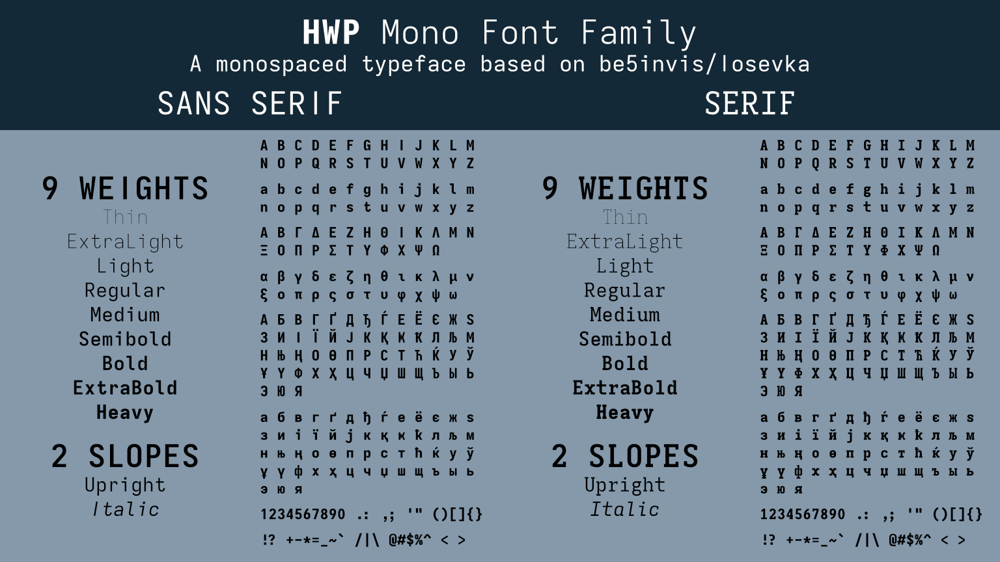

# HWP Mono Font Family

HWP Mono is a font created based on the [Iosevka](https://github.com/be5invis/Iosevka) font using [Iosevka Customizer](https://typeof.net/Iosevka/customizer) inherited from ss06 variant. This is the updated font from previous name, Iosevka HWP, which had to be removed because the previous font name contained Reserved Font Name (RFN) which violates the SIL Open Font License v1.1. This font family includes sans serif family (HWP Sans Mono) and serif family (HWP Serif Mono) with only monospace variant.

## About Iosevka

**Iosevka** [ˌjɔˈseβ.kʰa] is an _open-source_, _sans-serif_ + _slab-serif_, _monospace_ + _quasi‑proportional_ typeface family, designed for _writing code_, using in _terminals_, and preparing _technical documents_.

## Preview

  

## Changes from Original `ss06` Iosevka Variant

1. Default width is set to 600
2. Modified variants for all variants which can be seen in the `.toml` files under `[buildPlans.FontName.variants]`.
3. Use discretionary ligatures for default ligatures.
4. Oblique variants were not included.
5. See `CHANGELOG.txt` for other changes.

## 📦 Downloads

Download fonts from these links below:

- [HWPweb (latest version only)](https://files.aku-hafizulwananda.com/HwpMono.zip)
- [GitHub Releases](https://github.com/hafizulwanandaputra/hwp-mono-font/releases)

## ⚙️ Build

Use Linux, Windows Subsystem for Linux (WSL), macOS, or other UNIX based operating systems to compile the font.

To compile the font, run:

    git clone --depth 1 https://github.com/be5invis/Iosevka.git
    cd Iosevka
    npm install
    curl -L -O https://files.aku-hafizulwananda.com/HwpMonoCompileTools.zip
    unzip HwpMonoCompileTools.zip
    ./build.sh

To save your CPU and RAM usage, insert the `jCmd` value when running `build.sh`.

## Contents

- HWP Sans Mono (18 hinted ttf, 18 unhinted ttf, 18 hinted woff, 18 unhinted woff, 2 CSS files)
- HWP Serif Mono (18 hinted ttf, 18 unhinted ttf, 18 hinted woff, 18 unhinted woff, 2 CSS files)

Total: 148 files

## 🙏 Credits

This font is based on the Iosevka project.

## 📜 License

Released under the SIL Open Font License 1.1.  
See `LICENSE.txt` for details.
